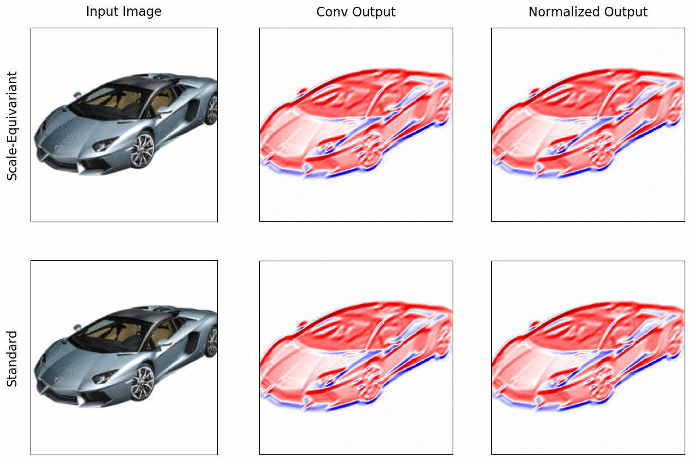

# Scale-Equivariant Steerable Networks

[](https://paperswithcode.com/sota/image-classification-on-stl-10?p=scale-equivariant-steerable-networks-1)

This is the code for reproducing the experiments from the paper: 

**Ivan Sosnovik, Michał Szmaja, and Arnold Smeulders** [Scale-Equivariant Steerable Networks](https://arxiv.org/abs/1910.11093), ICLR 2020.

*In this work, we pay attention to scale changes, which regularly appear in various tasks due to the changing distances between the objects and the camera. We develop scale-convolution and generalize other common blocks to be scale-equivariant. We demonstrate the computational efficiency and numerical stability of the proposed method. We compare the proposed models to the previously developed methods for scale equivariance and local scale invariance. We demonstrate state-of-the-art results on the MNIST-scale dataset and on the STL-10 dataset in the supervised learning setting.*



## Prepare datasets
In our research, we use MNIST-scale dataset - a simple modification of MNIST dataset. Specify the directory where the original MNIST dataset is located or where it will be downloaded and the directory where MNIST-scale will be generated. Then just run `prepare_mnist_scale.sh`.

```bash
# MNIST will be downloaded to ./datasets/MNIST
export MNIST_DIR=./datasets 
# MNIST-scale will be generated to ./datasets/MNIST_scale
export MNIST_SCALE_DIR=./datasets 
bash prepare_mnist_scale.sh
```

## MNIST-scale experiments
We have reimplemented various methods for scale-equivariant and local scale-invariant convolutions. In order to reproduce the results from our paper, run `experiments_mnist.sh`.
For us, it took about 2 days to run all experiments on a single Nvidia GeForce GTX 1080Ti . 
If you want to run some specific experiments, check `train_scale_mnist.py`.

## STL-10 experiments
Just specify a folder where STL-10 is located and run `experiments_stl.sh` to reproduce all the experiments from our paper.

```bash
export STL_DIR=./datasets/stl10
bash experiments_stl.sh
```

## Scale-Equivariant Steerable Convolution
If you are only interested in SESN building blocks, check [`models/impl/ses_basis.py`](https://github.com/ISosnovik/sesn/blob/master/models/impl/ses_basis.py) and [`models/impl/ses_conv.py`](https://github.com/ISosnovik/sesn/blob/master/models/impl/ses_conv.py). These files contain everything you need in order to make your CNN scale-equivariant.


## Acknowledgements
The Robert Bosch GmbH is acknowledged for financial support.

## BibTeX
If you found this work useful in your research, please consider citing
```
@inproceedings{
    Sosnovik2020Scale-Equivariant,
    title={Scale-Equivariant Steerable Networks},
    author={Ivan Sosnovik and Michał Szmaja and Arnold Smeulders},
    booktitle={International Conference on Learning Representations},
    year={2020},
    url={https://openreview.net/forum?id=HJgpugrKPS}
}
```
